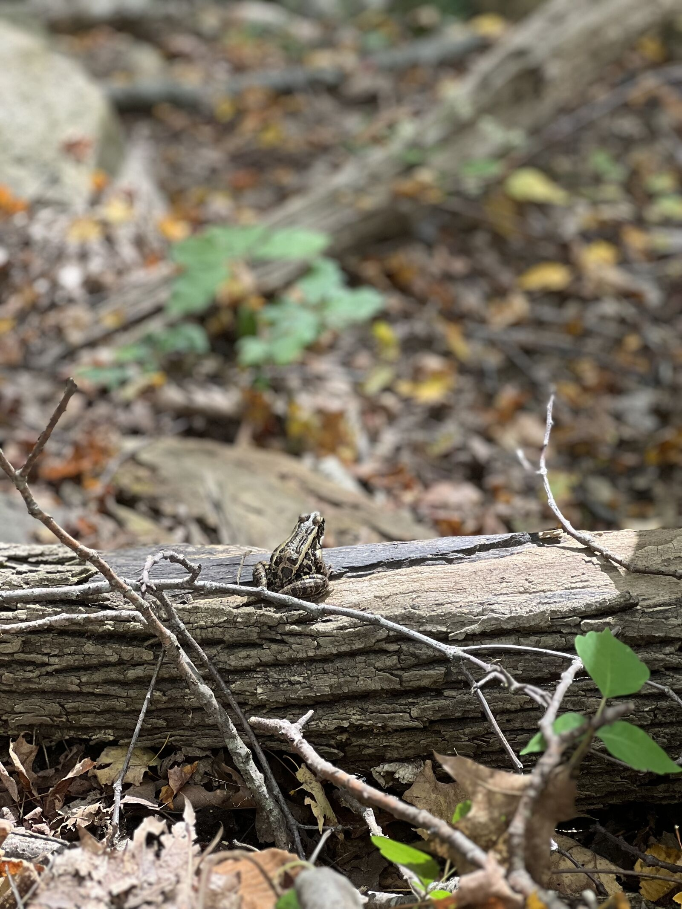

 

Riya was raised in Northern California. From August 2018 - May 2022 they attended Mills College, a women's centric liberal arts college, formerly based in Oakland California. While at Mills they earned their B.S. in Environmental Science and were involved with numerous campus clubs and research programs. Their research involvement in the final year of undergrad was arguably the most foundational, as it inspired them to puruse further studies in the evolution of social behaviors, phenotypic-, and genotypic- traits in both animals and plants.

Following undergrad, Riya relocated to New York City to complete a 2-year post-bacc at Columbia University's Ecology, Evolution, and Environmental Biology (E3B) department. During this period they became involved in The Bendesky Lab, based at the Mortimer B. Zuckerman Mind Brain Behavior Institute. They assisted on research seeking to understand the genetic- and molecular- processes driving hybridization in North American Deer Mice (genus: _Peromyscus_). 

In August 2024, Riya began a Master's degree in Columbia's E3B department. They recently joined the lab of Dr. Deren Eaton, where they are continuing to explore their research interests in hybridization. The Eaton Lab has an interest in plant phylogenetics, and as such Riya will be conducting research on hybridization between plants of the monoecious and dioecious clades of genus, _Amaranthus_.

Riya is an avid runner and swimmer. They are currently training for the NYC United Half Marathon. Outside of running and swimming they also dabble in basketball. They enjoy cooking up meals for themselves (and friends), as well as reading. 
